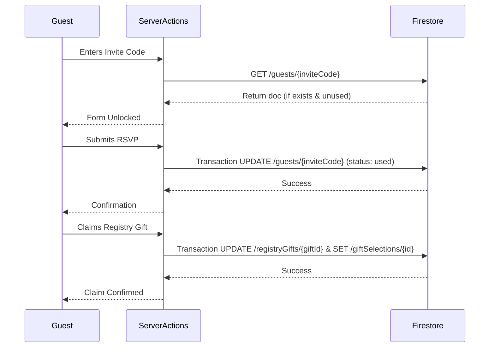

# Wedding RSVP App

A modern, full-stack Next.js application designed to manage wedding RSVPs and gift registry claims. The app is currently in active development, featuring a guest-facing landing page secured by single-use invite codes and a protected admin dashboard for managing guests, content, and the registry.

## Features

### Guest-Facing
*   **Invite Code Authentication**: Guests unlock the RSVP form using a unique, pre-generated code. Verified securely via `verifyInviteCode()` in `src/app/actions/rsvp.ts`.
*   **RSVP Submission**: Guests submit their attendance status and proxy/message details. Uses atomic Firestore transactions to mark codes as "used" (`submitRsvp()` in `src/app/actions/rsvp.ts`).
*   **Gift Registry Claiming**: Guests can browse registry gifts and claim them. Concurrency is prevented using transaction checks to enforce `maxCount` constraints (`claimGift()` in `src/app/actions/registry.ts`).

### Admin Dashboard
*   **Access Control**: Routes under `src/app/admin/` are secured, requiring Firebase Auth and Firestore `admins` collection validation.
*   **Guest Management**: Bulk generate unique, unguessable 6-character alphanumeric invite codes (excluding ambiguous characters like I, 1, O, 0) via `generateInviteCodes()` in `src/app/actions/admin.ts`. Admins can view usage status, delete, and regenerate codes.
*   **Registry Management**: Add, update, and remove gifts with limits (`addRegistryGift()`, `updateRegistryGift()`, `deleteRegistryGift()` in `src/app/actions/admin.ts`).
*   **Content Synchronization**: Push local content configuration to Firestore via the `node scripts/sync-content.js` script.

## Tech Stack

*   **Framework**: Next.js 16.2.9 (App Router)
*   **Styling**: Tailwind CSS v4 & Framer Motion
*   **Backend & DB**: Firebase 12 (Firestore, Firebase Admin) & Vercel
*   **Icons**: Lucide React

## Architecture

The application utilizes the Next.js App Router (`src/app/`), isolating the public landing view (`src/app/page.tsx`) from the protected dashboard (`src/app/admin/`). To maintain security, client-side Firestore writes are disabled (`firestore.rules`). All data mutations are handled by server-side actions (`src/app/actions/`) leveraging the `firebase-admin` SDK.

### Data Flow Diagram



## Prerequisites

*   Node.js v22.x (as specified in `package.json` engines)
*   Firebase project with Firestore and Authentication enabled
*   Vercel account (optional, for deployment)

## Environment Variables

Copy `.env.local.example` to `.env.local` and configure your Firebase credentials. Do not commit `.env.local`.

| Variable | Required | Description |
| :--- | :--- | :--- |
| `NEXT_PUBLIC_FIREBASE_API_KEY` | Yes | Firebase Client API Key |
| `NEXT_PUBLIC_FIREBASE_AUTH_DOMAIN` | Yes | Firebase Client Auth Domain |
| `NEXT_PUBLIC_FIREBASE_PROJECT_ID` | Yes | Firebase Client Project ID |
| `NEXT_PUBLIC_FIREBASE_STORAGE_BUCKET` | Yes | Firebase Client Storage Bucket |
| `NEXT_PUBLIC_FIREBASE_MESSAGING_SENDER_ID` | Yes | Firebase Client Messaging Sender ID |
| `NEXT_PUBLIC_FIREBASE_APP_ID` | Yes | Firebase Client App ID |
| `FIREBASE_ADMIN_PROJECT_ID` | Yes | Firebase Admin SDK Project ID |
| `FIREBASE_ADMIN_CLIENT_EMAIL` | Yes | Firebase Admin SDK Client Email |
| `FIREBASE_ADMIN_PRIVATE_KEY` | Yes | Firebase Admin SDK Private Key |

## Installation & Local Dev

1.  **Install dependencies**:
```bash
    npm install
```

2.  **Start the development server**:
```bash
    npm run dev
```

3.  **Build for production**:
```bash
    npm run build
```

4.  **Start production server**:
```bash
    npm run start
```

5.  **Sync initial content to Firestore** (Optional):
```bash
    npm run sync-content
```

6.  **Linting**:
```bash
    npm run lint
```

## Firestore Data Model

Client writes are strictly disabled via `firestore.rules`. Server actions handle mutations directly.

*   `guests`
    *   `ID`: {inviteCode}
    *   `Fields`: `inviteCode` (string), `codeStatus` ("unused" | "used"), `fullName` (string), `email` (string), `phoneNumber` (string), `willAttend` ("Yes" | "No"), `proxyName` (string), `message` (string), `createdAt` (timestamp), `submittedAt` (timestamp)
*   `registryGifts`
    *   `Fields`: `name` (string), `link` (string), `maxCount` (number), `currentCount` (number), `isFull` (boolean), `createdAt` (timestamp)
*   `giftSelections`
    *   `Fields`: `giftId` (string), `giftName` (string), `fullName` (string), `email` (string), `message` (string), `selectedAt` (timestamp)
*   `admins`
    *   `ID`: {firebase_auth_uid} (Used solely for access control validation)
*   `websiteContent`
    *   `Fields`: Key-value pairs for customizable text and image overrides.

## Admin Dashboard Guide

Located at `/admin`, access requires a valid Firebase Auth user whose UID exists in the `admins` Firestore collection. Supported capabilities:
*   **Invites/Guests**: Bulk generation of secure 6-character alphanumeric invite codes, excluding ambiguous characters (`I`, `1`, `O`, `0`) to reduce guest input errors. Admins can view usage status and regenerate or delete codes.
*   **Registry**: Add distinct gifts specifying a `maxCount`. Monitor active claims under each item.
*   **Content**: Modify dynamic website text/images.

## Deployment

Designed for seamless deployment on Vercel. Connect the repository to Vercel and map the environment variables specified above into the project's settings. No explicit `vercel.json` exists; standard Next.js build detection applies.

## Known Gaps / Unverified

*   **LICENSE**: No `LICENSE` file is present in the repository. Please add one if the project will be public.

## License

*(Missing - No LICENSE file found in the project root)*